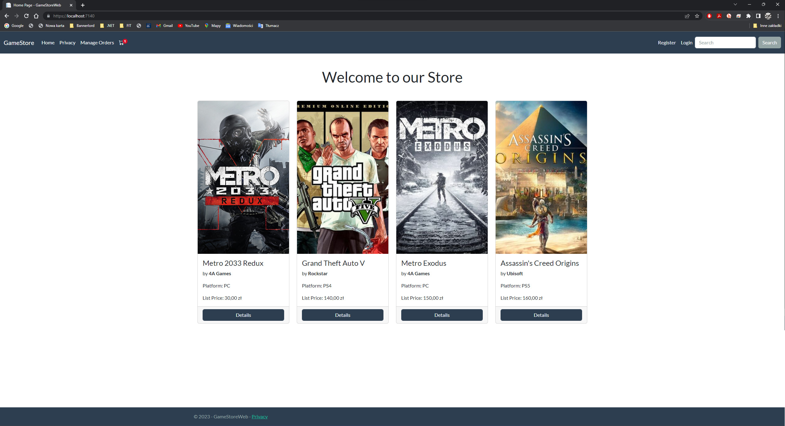
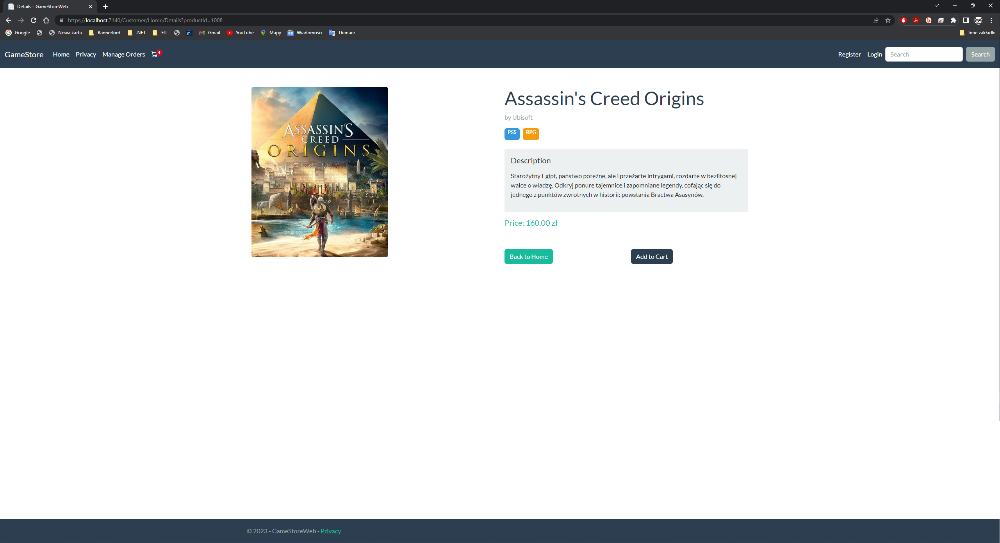
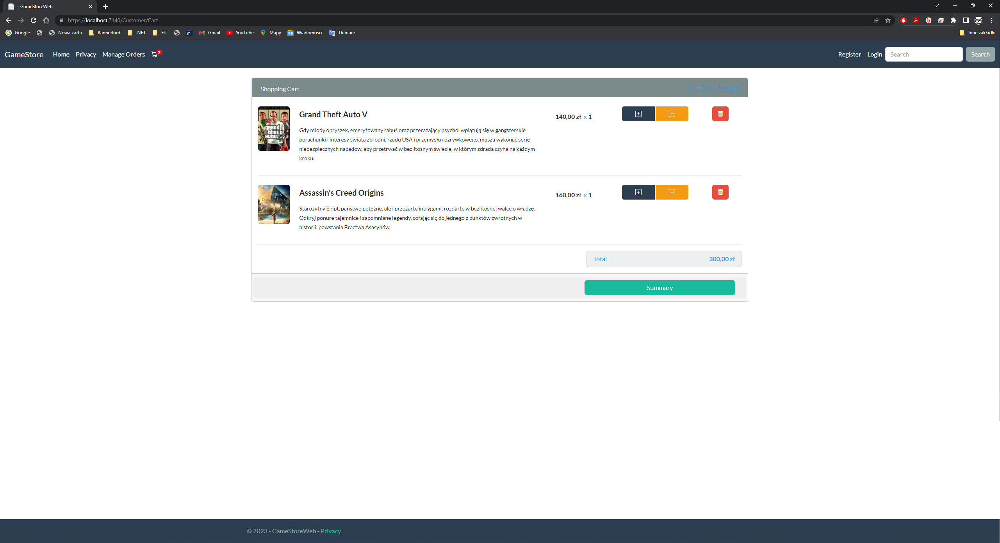
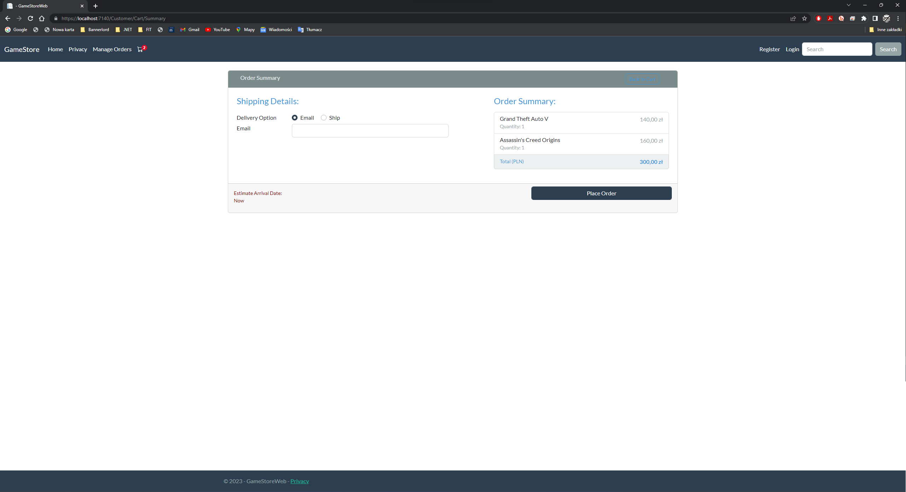
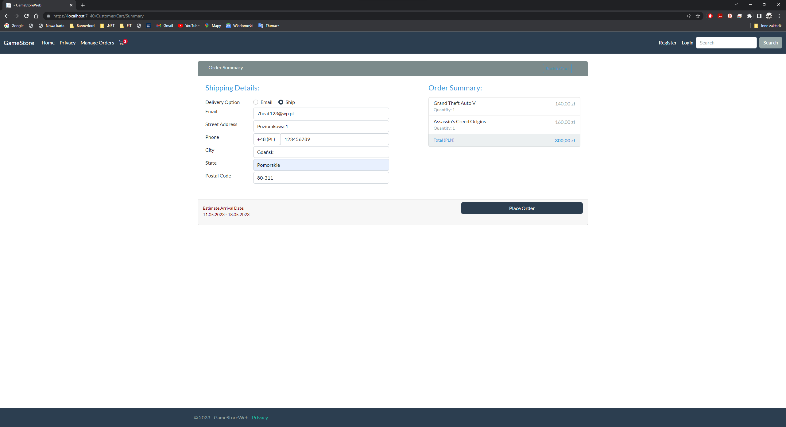
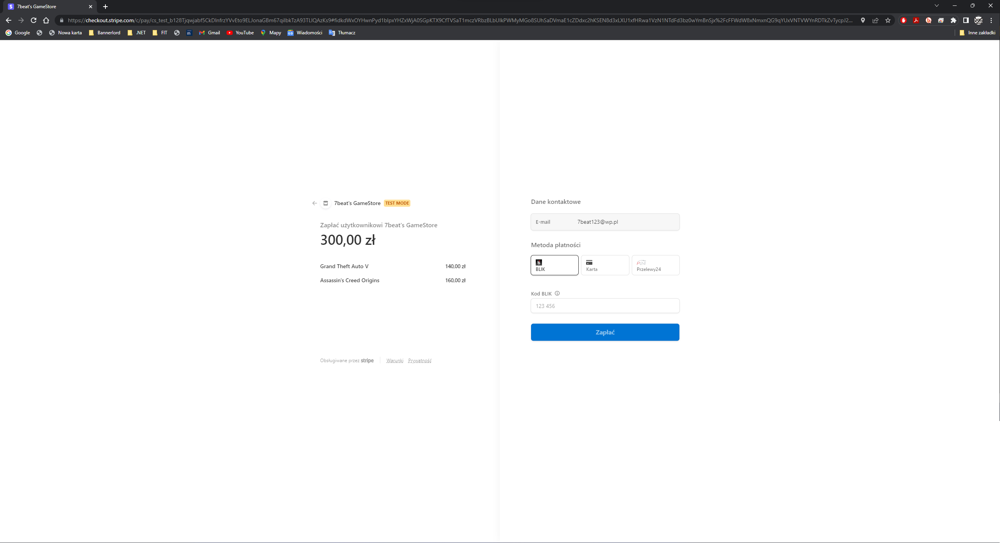
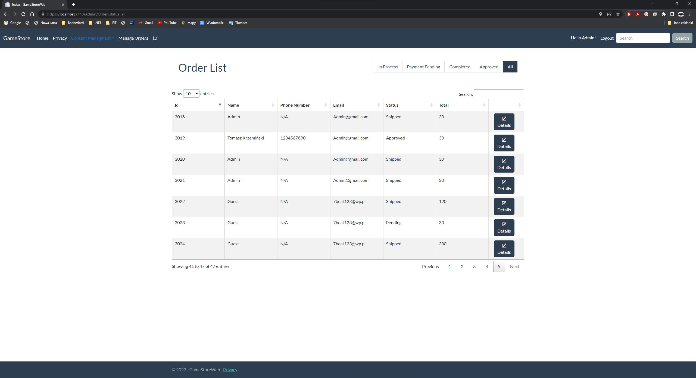
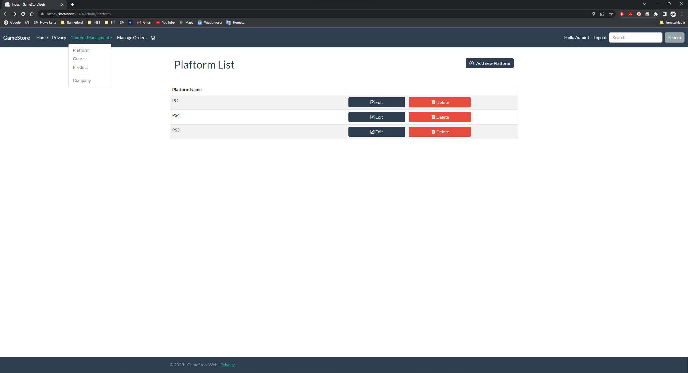
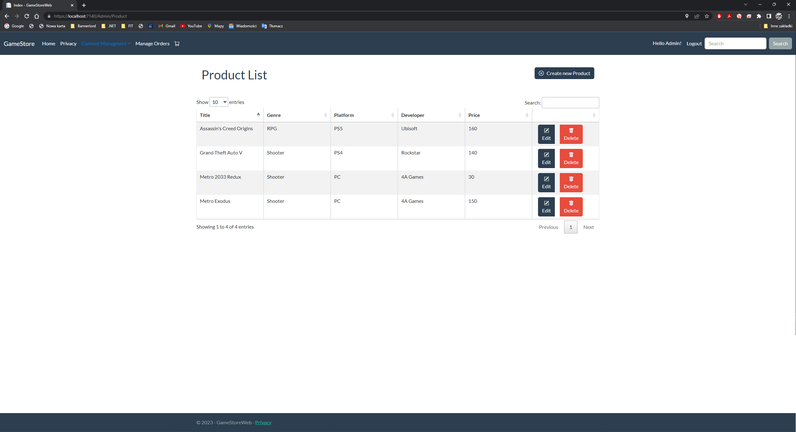
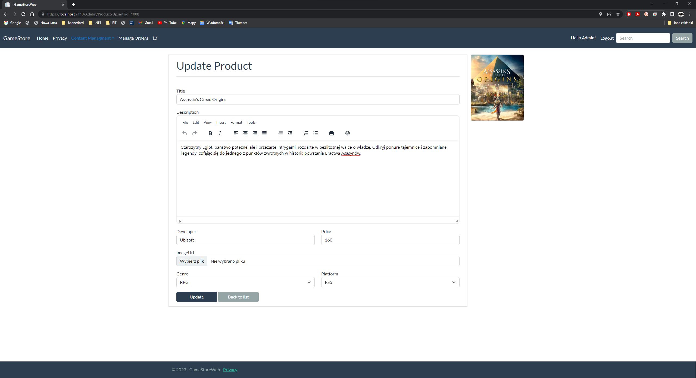

# GameStore Web Application
## Summary
The GameStore Web Application is a simple e-commerce platform that allows users to search for and purchase games. The application also features a robust Content Management System (CMS) for authorized users, allowing them to easily modify, add, and delete products. The project is primarily focused on the back-end development, with a clean and minimalistic user interface.

## Features
* User authentication and authorization for secure access to the application
* Entity Framework and Unit of Work patterns for efficient data management
* Database shopping cart for registered users, allowing them to easily manage their cart across sessions
* Cookie-based shopping cart for anonymous users, providing a seamless user experience
* Integration of Stripe payments for secure online transactions
* Order management for tracking and managing user orders
* Custom theme support for easy customization of the application's appearance
* Users seeding with assigned roles for quick setup and role-based access control
* Unit Tests to ensure that critical features function as intended

## Technologies Used
* Front-end: HTML, CSS, JavaScript
* Back-end: ASP.NET Core, C#
* Database: Entity Framework, SQL Server
* Authentication and Authorization: ASP.NET Core Identity
* Payment Gateway: Stripe

## Future Enhancements
* Implementing user reviews and ratings for games
* Enhancing the front-end design with modern UI/UX trends
* Adding social media authentication options for user sign-up/login

# Images

### Home Index

### Home Details

### Cart Index

### Cart Summary Email

### Cart Summary Ship

### Stripe Payment

### Order Confirmation

### Order Management

## CMS

### Platform

### Products List

## Update Product

